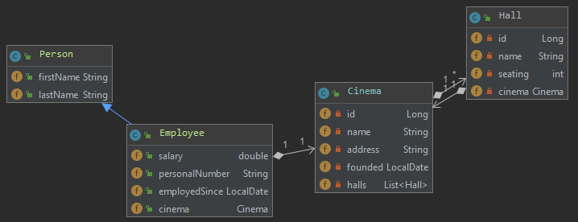

= Cinema - Mario Lengauer
:source-highlighter: coderay
:sourcedir: src/main/java/at/htl/cinema
:toc:

== Übersicht
=== Klassendiagramm

=== ERD
image::images/erd.PNG[]

=== Use-Cases
[plantuml]
----
left to right direction
skinparam packageStyle rectangle
actor cinemaboss as "Geschäftschäftsführer"

rectangle checkout {
usecase UC1 as "Ein neues Kino in den Bestand aufnehemn"
usecase UC2 as "Einen neuen Saal hinzufügen"
usecase UC3 as "Mitarbeiter hinzufügen"
usecase UC3 as "Mitarbeiter der einzelnen Kinos ansehen"

cinemaboss --> UC1
cinemaboss --> UC2
cinemaboss --> UC3
}
----

== Erstellung des Projektes

[source]
----
mvn io.quarkus:quarkus-maven-plugin:1.0.0.CR1:create \
    -DprojectGroupId=at.htl \
    -DprojectArtifactId=cinema \
    -DclassName="at.htl.cinema.rest.cinema" \
    -Dpath="/cinema"
----

=== DB konfigurieren
in application.properties folgendes eintragen:
[source]
----
quarkus.datasource.url=jdbc:postgresql://192.168.99.100/postgres
quarkus.datasource.driver=org.postgresql.Driver
quarkus.datasource.username=postgres
quarkus.datasource.password=passme
quarkus.datasource.min-size=3
quarkus.datasource.max-size=13
quarkus.hibernate-orm.database.generation=drop-and-create
----

=== Dependencies hinzufügen
für Hibernate
[source,xml]
----
include::pom.xml[lines=44..51]
----
und für Panache ist dieses auch noch nötig
[source,xml]
----
    <dependency>
        <groupId>io.quarkus</groupId>
        <artifactId>quarkus-hibernate-orm-panache</artifactId>
    </dependency>
----
=== LocalDate
[source]
----
    <dependency>
      <groupId>io.quarkus</groupId>
      <artifactId>quarkus-resteasy-jackson</artifactId>
    </dependency>
----
Usage
[source,java]
----
    @JsonDeserialize(using = LocalDateDeserializer.class)
    @JsonSerialize(using = LocalDateSerializer.class)
    @JsonFormat(shape = JsonFormat.Shape.STRING, pattern = "yyyy-MM-dd")
    private LocalDate date;
----
=== Swagger UI
Extension installieren
[source]
----
mvnw quarkus:add-extension -Dextensions="openapi"
----
Erreichbar unter

[source]
----
http://localhost:8080/swagger-ui/
----
== Projekt starten
=== Db im Docker Container Starten
[source]
----
docker run --name some-postgres -p 5432:5432 -e POSTGRES_PASSWORD=passme -d postgres
----

=== Quarkus im Dev Mode starten
[source]
----
mvnw compile quarkus:dev
----

=== Quarkus im Docker starten
[source]
----
mvnw clean package
docker build -f src/main/docker/Dockerfile.jvm -t quarkus/cinema .
docker run -i --rm -p 8080:8080 quarkus/cinema
----
Da ich die DockerToolbox verwende ist der Service erreichbar unter
[source]
----
http://192.168.99.100:8080/cinema
----

== Unterschied Panache Hibernate

Einziger Nachteil von Panache den ich sehe, ist die noch sehr spärliche Dokumentation. Das erschwert das Programmieren erheblich, da man kaum Antworten auf die Probleme findet.
Ansonsten spart man sich durch Panache einigen Aufwand. z.B. eigenes Facade
